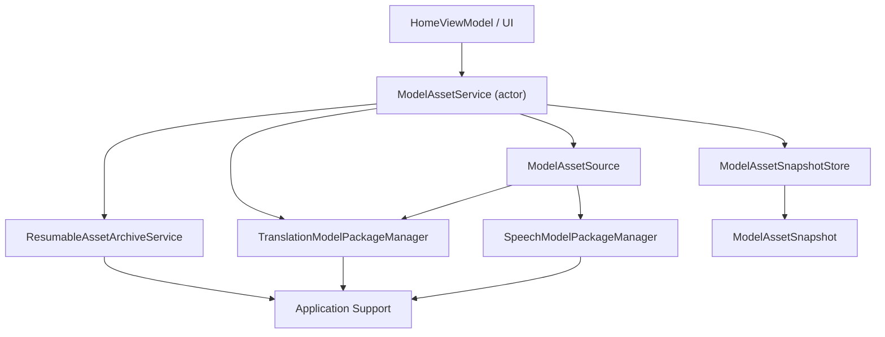

# ModelAssets

`ModelAssets` 模块负责统一管理本地 AI 模型资源，包括：

- 翻译模型
- 语音识别模型
- 下载中的临时状态
- 已安装资源索引
- 断点续传与失败恢复

它不是单一的下载器，也不是单一的 repository，而是一套围绕 `ModelAssetService` 组织起来的资源编排系统。

## 模块定位

这个模块的核心职责是：

1. 把不同类型的模型资源抽象成统一的 `ModelAsset`
2. 对外提供一致的资源查询、下载、恢复、删除接口
3. 维护一个可订阅的资源快照 `ModelAssetSnapshot`
4. 在应用启动后恢复已安装状态和未完成下载
5. 为翻译流程提供“资源是否就绪”的能力判断

## 架构总览

从职责上看，这个模块可以拆成 6 层：

1. 编排层
   - `ModelAssetService.swift`
2. 资源源适配层
   - `ModelAssetSource.swift`
3. 下载基础设施层
   - `ResumableAssetArchiveService.swift`
4. 状态聚合层
   - `ModelAssetSnapshotStore.swift`
5. 统一领域模型层
   - `ModelAssetTypes.swift`
6. 展示与存储辅助层
   - `ModelAssetPresentationMapper.swift`
   - `ModelAssetStoragePaths.swift`

### 关系图



## 核心设计思想

### 1. actor 编排

`ModelAssetService` 是模块的总调度中心。

它自己的职责不是实现所有底层细节，而是定义并维护资源管理的整体流程，例如：

- 启动时先加载什么
- 下载前如何防重复启动
- 下载中如何更新状态
- 下载完成后如何安装
- 安装失败后如何恢复或保留续传信息

这里说的“actor 编排”，意思是：

- 用 `actor` 作为流程协调者
- 用 `actor` 隔离内部状态访问，降低并发竞争
- 把下载、安装、状态聚合这些能力交给其他组件
- 由 `ModelAssetService` 负责把这些组件按正确顺序串起来

这和“基类里写 `run()`，子类 override 步骤”的模板方法模式有一点像，都是“主流程固定、步骤可替换”。

但这里不是靠继承做扩展，而是靠组合：

- `ModelAssetService` 组合了 source、archive service、snapshot store
- 不同资源类型通过 `ModelAssetSource` 协议适配
- 并发安全由 `actor` 提供，而不是由调用方自己保证

### 2. protocol 抽象 + 组合

`ModelAssetSource` 协议负责统一“不同模型类型”的访问方式。

当前有两个实现：

- `TranslationModelAssetSource`
- `SpeechModelAssetSource`

它们都暴露相同能力：

- 列出可下载资源
- 列出已安装资源
- 根据 `packageId` 解析 `ModelAsset`
- 安装资源
- 删除已安装资源

这部分体现的是“可替换性”和“多态”；而 `ModelAssetService` 负责“流程协调”。

## 各文件职责

### `ModelAssetService.swift`

模块入口和编排中心。

对外提供的主要能力：

- `warmUp()`
- `snapshotStream()`
- `currentSnapshot()`
- `startTranslationAssets(packageIDs:)`
- `startSpeechAsset(packageId:)`
- `retry(assetID:)`
- `resume(assetID:)`
- `removeInstalledAsset(id:)`

同时它还实现了 `TranslationAssetReadinessProviding`，因此翻译流程可以直接依赖它判断模型是否准备好。

### `ModelAssetSource.swift`

资源类型适配层。

作用是把“翻译模型”和“语音模型”这两套底层 package manager 封装成统一接口，避免 `ModelAssetService` 直接写两套不同逻辑。

### `ResumableAssetArchiveService.swift`

负责下载归档包，并支持断点续传。

主要能力包括：

- 通过 `HEAD` 或 `Range: bytes=0-0` 获取远端 metadata
- 依据 `chunkSize` 分块下载
- 将部分下载内容写入 `archive.part`
- 将续传状态写入 `state.json`
- 校验 `ETag` / `Last-Modified` / `Content-Length`
- 失败重试
- 检测远端归档变化并重置无效缓存

### `ModelAssetSnapshotStore.swift`

资源状态聚合层。

它维护三类记录：

- `transientRecordsByID`
  - 下载中、失败、可恢复
- `installedRecordsByID`
  - 已安装
- `availableRecordsByID`
  - 可下载但尚未开始

它会把这三类数据合并成 `ModelAssetSnapshot`，并通过 `AsyncStream` 持续推给 UI。

### `ModelAssetTypes.swift`

统一领域模型定义。

关键类型：

- `ModelAssetKind`
- `ModelAssetState`
- `ModelAsset`
- `ModelAssetTransferStatus`
- `ModelAssetRecord`
- `ModelAssetSummary`
- `ModelAssetSnapshot`

这层的目标是把 translation/speech 两条资源线折叠为统一的数据表达。

### `ModelAssetPresentationMapper.swift`

把底层 package metadata 转成 UI 友好的 `ModelAsset`。

比如：

- 翻译模型标题会被映射为 `source -> target`
- 语音模型会有统一的标题和副标题
- 已安装资源在没有真实 archive URL 时会生成 placeholder URL

### `ModelAssetStoragePaths.swift`

统一管理模块使用到的磁盘路径。

目录结构大致如下：

```text
Application Support/
  TranslationModels/
    downloads/
      <packageId>/
        archive.part
        state.json
    packages/
      <packageId>/
    installed.json
    tmp/
  SpeechModels/
    downloads/
      <packageId>/
        archive.part
        state.json
    packages/
      <packageId>/
    installed.json
    tmp/
```

## 运行流程

### 1. 启动预热

应用启动后会创建 `ModelAssetService`，并在后台执行 `warmUp()`。

`warmUp()` 的顺序是：

1. 加载已安装资源
2. 恢复磁盘上未完成的下载记录
3. 加载当前可下载资源

这个顺序的意义是：

- 已安装资源优先占位
- 未完成下载可以恢复成 `pausedResumable`
- 可下载列表最后补齐，避免和前两类记录重复显示

### 2. 发起下载

当 UI 请求下载某个资源时：

1. `ModelAssetService` 根据资源类型选择对应的 `ModelAssetSource`
2. 解析出统一的 `ModelAsset`
3. 在 `ModelAssetSnapshotStore` 里 `reserveRun`
4. 如果已经有同一个 asset 在跑，则直接拒绝重复启动
5. 创建任务执行 `runDownload(for:)`

### 3. 下载与安装

下载任务的主流程如下：

```text
resolve asset
-> reserve run
-> download archive
-> verifying
-> installing
-> install asset
-> clear persisted transfer
-> reload installed records
-> reload available records
```

下载过程中，`ResumableAssetArchiveService` 会持续上报：

- 已下载字节数
- 总字节数
- 速度
- 是否可续传

这些状态最终会被转成 `ModelAssetTransferStatus` 并写回 `ModelAssetSnapshotStore`。

### 4. 失败与恢复

如果下载过程中出错：

- 当前运行任务会被清理
- 如果本地还有部分下载内容，会保留为可恢复状态
- 如果失败发生在 `verifying` 或 `installing` 阶段，则会清理无效的持久化下载痕迹
- UI 最终看到的状态会是 `failed`，但可能带 `isResumable = true`

应用下次启动时：

- `warmUp()` 会读取磁盘上的 `state.json`
- 把这些记录恢复成 `pausedResumable`
- 用户可以重新触发 `resume(assetID:)`

## 状态模型

资源状态统一使用 `ModelAssetState` 表示：

- `idle`
- `preparing`
- `downloading`
- `verifying`
- `installing`
- `completed`
- `failed`
- `pausedResumable`

其中：

- `idle` 表示可下载但未开始
- `pausedResumable` 表示本地存在可续传进度
- `completed` 一般对应已安装记录

`ModelAssetSnapshotStore` 会按状态优先级排序：

1. `preparing`
2. `downloading`
3. `verifying`
4. `installing`
5. `pausedResumable`
6. `failed`
7. `idle`
8. `completed`

这样 UI 能优先看到最需要关注的资源。

## 对 UI 的输出方式

UI 不直接管理下载任务细节，而是订阅 `snapshotStream()`。

这意味着：

- ViewModel 不需要知道下载器内部怎么实现
- UI 拿到的是稳定的快照模型，而不是零散的回调
- 资源列表、角标、状态文案都可以从 `ModelAssetSnapshot` 推导出来

这是典型的“命令入口 + 状态流输出”模式：

- 命令入口：`start` / `retry` / `resume` / `remove`
- 状态输出：`AsyncStream<ModelAssetSnapshot>`

## 与翻译流程的关系

`ModelAssetService` 不只是下载 UI 的后端，它还承担翻译资源就绪性检查。

它实现了 `TranslationAssetReadinessProviding`，可以回答：

- 当前翻译路径缺哪些包
- 某条翻译路径的资源是否已经准备好

这样翻译业务不需要直接依赖底层下载或存储细节，只依赖“资源 readiness”这个更高层的能力。

## 为什么这里不用继承做主结构

如果用继承，也可以做出类似结构，例如：

- 基类定义统一的下载主流程
- 子类分别处理 translation / speech 的具体细节

但当前实现选择了“组合优先”，原因是：

1. translation 和 speech 的共同点主要在资源管理流程，而不是完整行为完全一致
2. 下载、安装、快照、展示映射本身就是独立职责，拆开更清晰
3. `actor` 更适合作为流程协调中心，而不是作为一串继承层级中的某个父类
4. protocol + 组合更方便后续继续接入第三种模型资源

可以这样理解：

- `ModelAssetSource` 负责“同一接口，不同实现”
- `ModelAssetService` 负责“统一流程，统一调度”
- `actor` 负责“并发安全和状态隔离”

## 扩展方式

如果未来要新增一种模型资源，例如 OCR 模型，推荐步骤如下：

1. 在 `ModelAssetKind` 中增加新类型
2. 为新类型实现对应的 package manager
3. 新增一个 `ModelAssetSource` 实现
4. 在 `ModelAssetPresentationMapper` 中补上映射逻辑
5. 在 `ModelAssetService.source(for:)` 中接入
6. 在 `warmUp()` 和刷新逻辑中把新类型纳入聚合
7. 复用现有 `ResumableAssetArchiveService` 和 `ModelAssetSnapshotStore`

这样新增能力时，主流程不需要重写，只需要补充新的适配对象。

## 一句话总结

`ModelAssets` 的核心架构是：

**用 `actor` 做资源管理流程编排，用 `protocol` 统一不同资源类型，用快照流向 UI 暴露状态，用可恢复下载服务承接磁盘与网络细节。**
